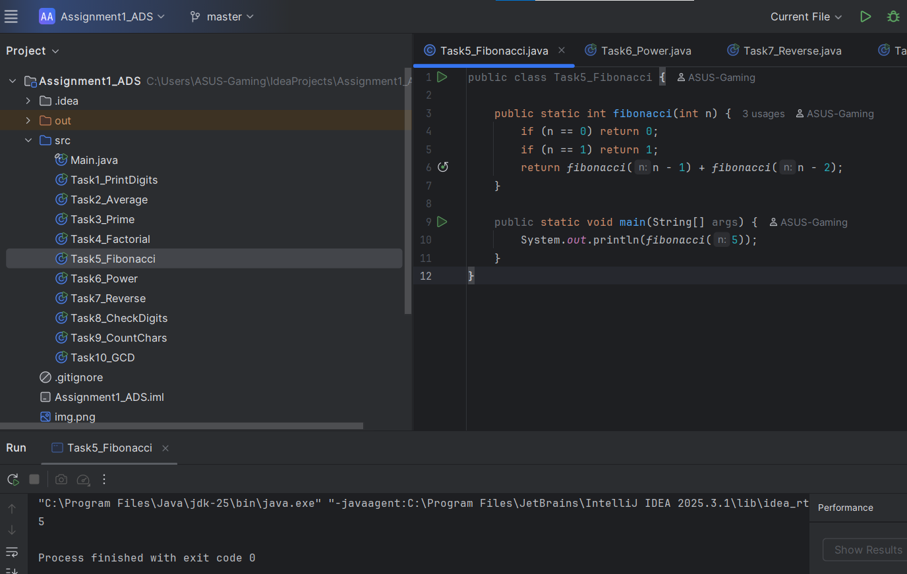
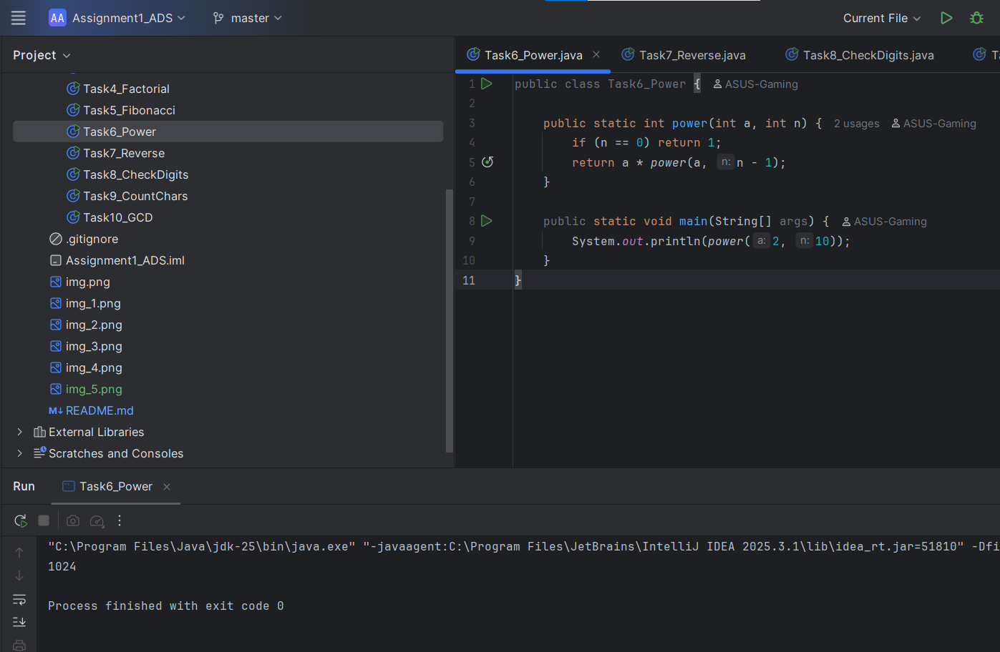
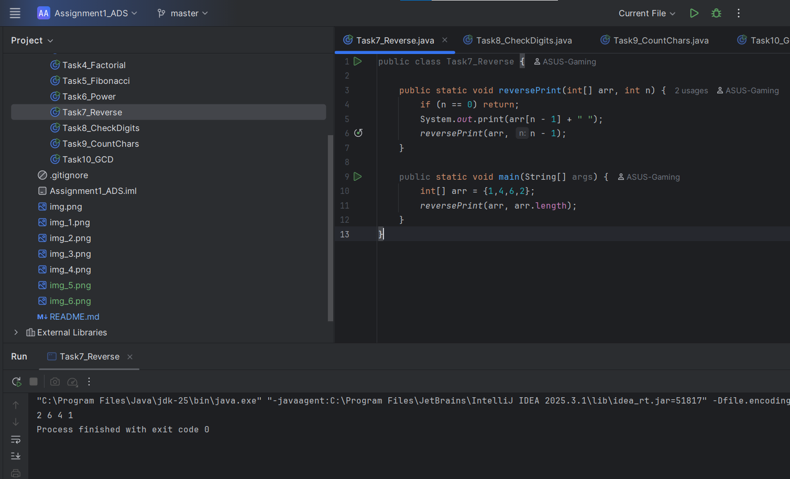
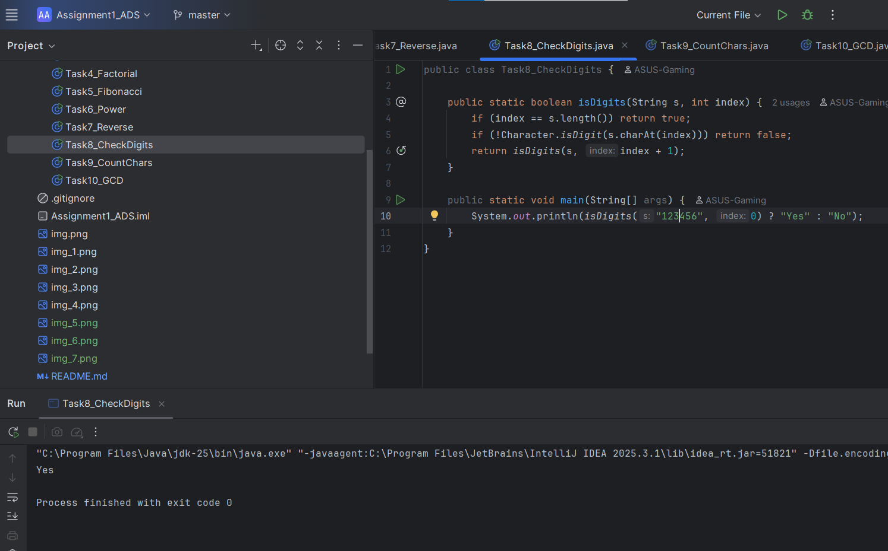
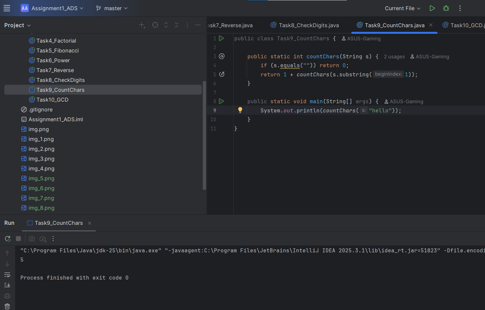
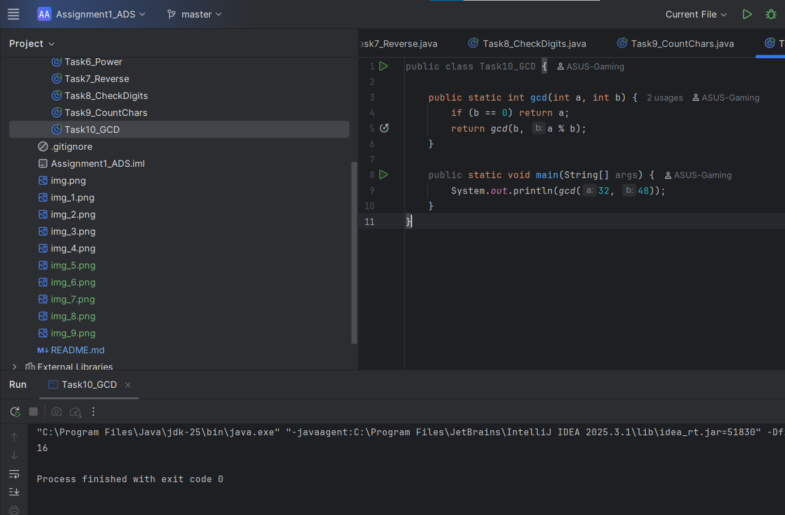

# Assignment 1

Name: Yerali Karkinbayev 
Group: IT-2501

## Objective
To use the recursion in different mathematical tasks and apply correct logic to them
# Part 1 – Recursion with Numbers

### Task 1- Print Digits of a Number

The input number is divided by 10 using recursion and works until n becomes 0(base case) and the digits are printed while returning from recursion

### Task 2- Average of Elements

The sum of the array elements is calculated using recursion. Then, after that the average is computed using "s/n" formula(Sum divided by number of elements)

### Task 3 – Prime Number Check

The function is checking if the number is dividable by any number starting from 2 (n <= 2), if not, then the number is prime

### Task 4 – Factorial

The function calculates factorial using "n!= n * (n-1)!" and recursion stops when n=1.
# Part 2 – Recursion with Sequences

### Task 5 – Fibonacci Number

The fibonaci number is calculated with this formula: "F(n)=F(n-1) +F(n-2)"
Base cases are F(0)=0, F(1)=1
### Task 6 – Power Function

The function calculates the power with this formula: "a^n = a *a^(n-1)"
Base case is n=0
### Task 7 – Reverse Output

The function basically prints elements from the end to the beginning
# Part 3 – Recursion with Strings

### Task 8 – Check Digits in String

Every character is checked recursively. If all characters are digits, then will be printed "Yes", otherwise "No"
### Task 9 – Count Characters

The string deletes one character at a time and will repeat until it's empty. Each step adds 1 to the count
### Task 10 – GCD

The euclidean algorithm is used this way: gcd(a,b)= gcd(b, a%b). base case is b=0

# Summary
In this assignment I solved 10 different arithmetic problems using recursion only. 
Each of the functions includes a base and a recursive case.

Now I know how recursion works, the importance of base cases, how to divide problems into smaller problems and how recursion replaces loops.
I didn't use any loops, only recursion