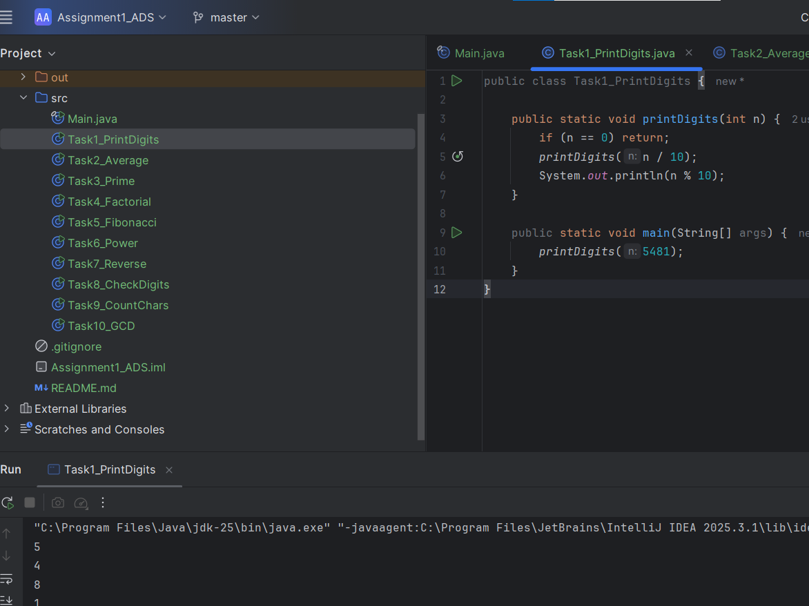
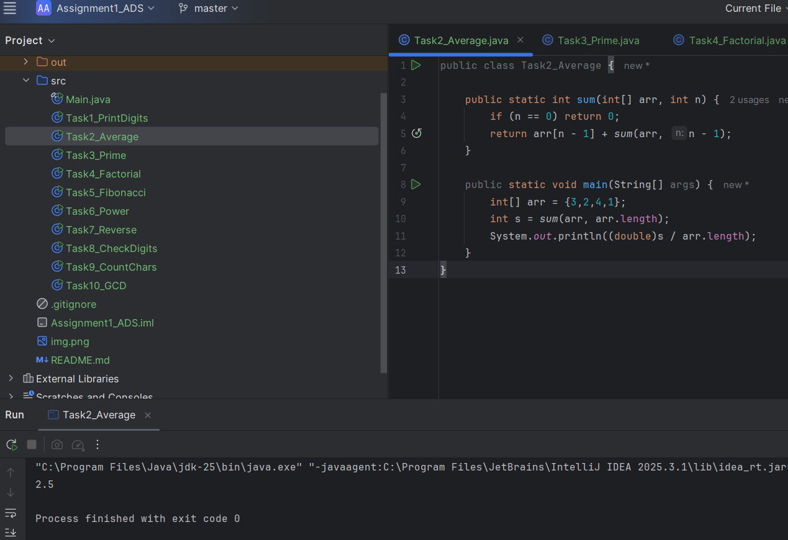
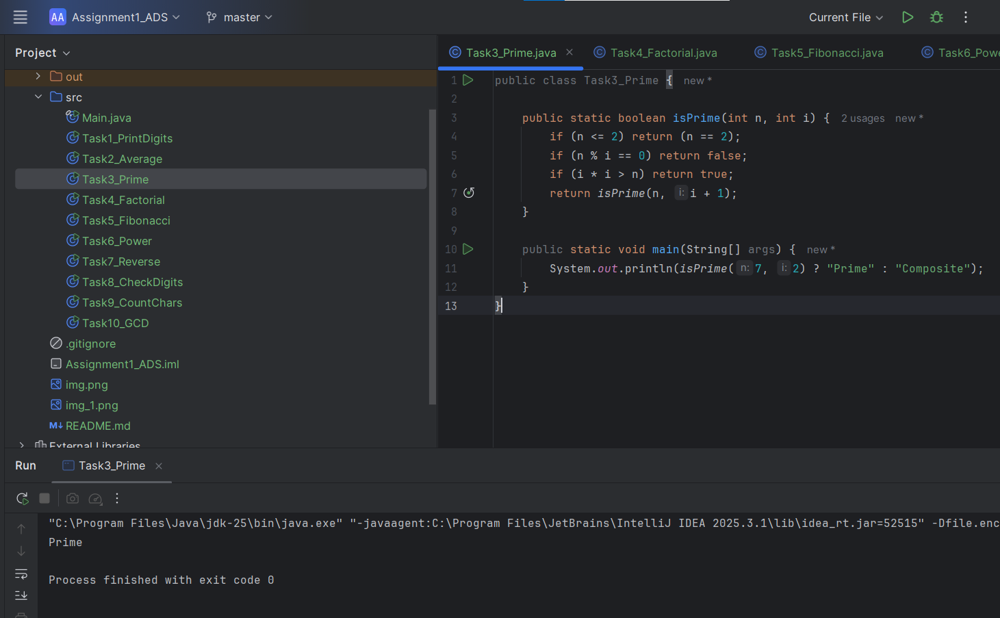
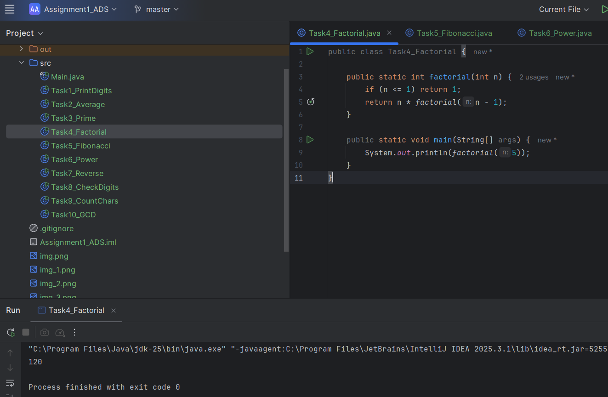

# Assignment 1

Name: Yerali Karkinbayev 
Group: IT-2501

## Objective
To use the recursion in different mathematical tasks and apply correct logic to them

# Part 1 – Recursion with Numbers

### Task 1- Print Digits of a Number

The input number is divided by 10 using recursion and works until n becomes 0(base case) and the digits are printed while returning from recursion

### Task 2- Average of Elements

The sum of the array elements is calculated using recursion. Then, after that the average is computed using "s/n" formula(Sum divided by number of elements)

### Task 3 – Prime Number Check

The function is checking if the number is dividable by any number starting from 2 (n <= 2), if not, then the number is prime

### Task 4 – Factorial

The function calculates factorial using "n!= n * (n-1)!" and recursion stops when n=1.
# Part 2 – Recursion with Sequences

### Task 5 – Fibonacci Number

### Task 6 – Power Function

### Task 7 – Reverse Output

# Part 3 – Recursion with Strings

### Task 8 – Check Digits in String

### Task 9 – Count Characters

### Task 10 – GCD
